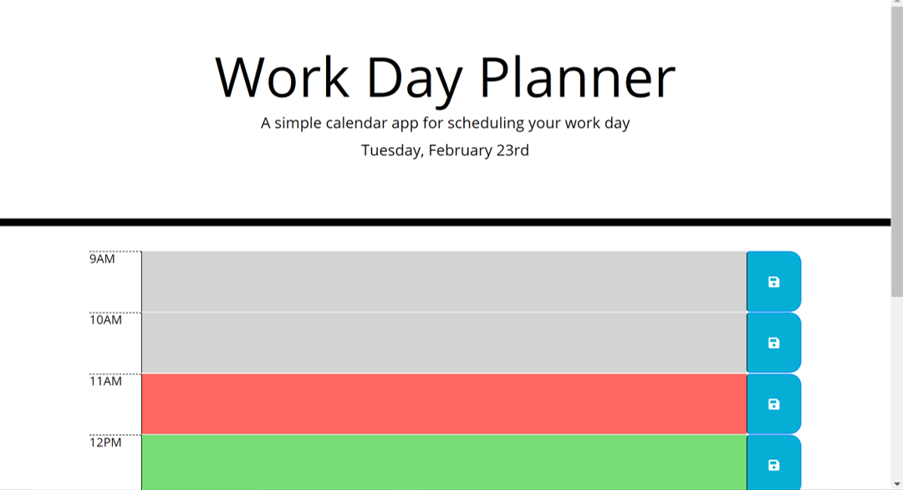
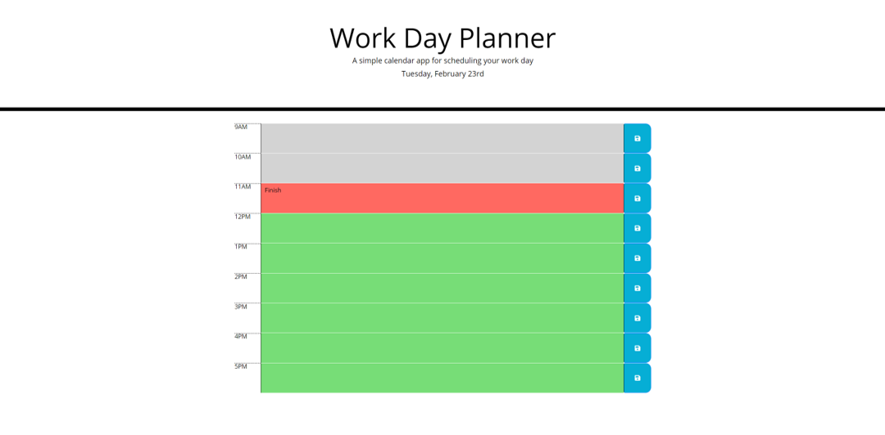
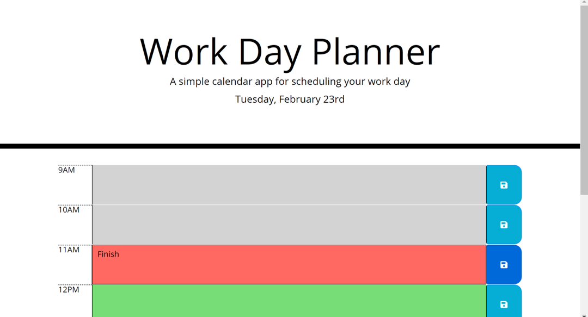

# Work Day Planner
## Project Overview:
This simple Work Day Planner, displays a calendar of the current day, the user can access the timeblocks and enter the items to be scheduled and press save to see the inputs through the day.

The calendar is designed to follow the 9 to 5 working hours. 

The calendar is color coded so that the past timeblock is grey, the current timeblock is red while the future timeblock is green.

Accessing the Application: [Work Day Planner](https://nohaashraf85.github.io/Day-Planner/)

## Technologies Used:
1. HTML
2. CSS and Bootstrap
3. jQuery
4. moment.js

## How it works:
1. Upon accessing the calendar, the user is presented with a one page application that displays the current date (Day of the week, Month, Day of the Month)

2. The Work Day Planner displays the usual working hours as a default, (9-5), and the timeblocks are set to be on hourly basis

3. To add an entry to any of the timeblocks, the user clicks on the text area corresponding to the timeblock and types the input desired, to save this entry, the user shall press the save button corresponding to the timeblock. If the page is refreshed oro the webpage is closed or reloaded, the entry presists

